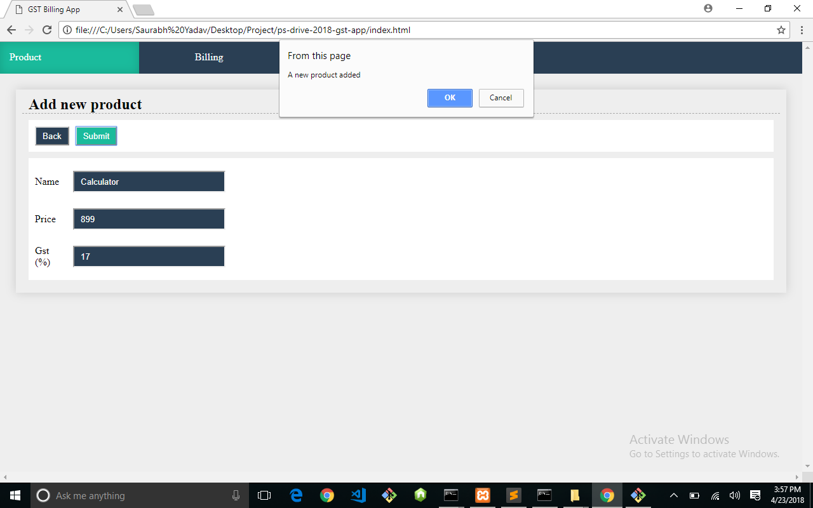

# ps-drive-2018-gst-app

In this app new product can be added, existing products can be edited in product entry page. Then in billing page all existing products are displayed in a table with search option to search according to any field. After selecting the product its quantity can be changed and total cost of that product and gross total cost will be updated dynamically.<br>

### Requirements
MySQL Server running with a database name new_project.<br>

### Steps

1. Select database in mysql and create table in mysql.
```
	$ mysql -u root -p
	$''
	$create database new_project;
	$use new_project;
	$create table tb_products (ID INT NOT NULL AUTO_INCREAMENT, name varchar(30), price int, gst int, PRIMARY KEY(ID));
```

2. Clone Git repository.
```
	$ git clone https://github.com/ImSaurabhYadav/ps-drive-2018-gst-app.git
```

3. Go to directory "ps-drive-2018-gst-app" and run command.
```
	$ node app.js
```

4. If it doesn't work in Chrome, go to directory of chrome.exe and run the command.
```
	$ chrome.exe --disable-web-security --user-data-dir="c:\data"
```


### Screenshots
1. Product Page:

<br>

2. Add new Product

<br>

3. Edit Product details

<br>

4. Delete Product

<br>

5. Billing Page

<br>

6. Search with product Code

<br>

